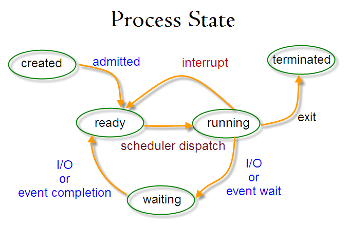

# iCORE Workshop: Linux for Researchers

## Introduction

- Students researchers often required to use Linux systems, local workstations or remote servers, with minimal training
- This tutorial addresses some of their common questions and concerns
- But this is not a tutorial for command line and scripting basics, since there is no shortage of high quality resources available

### Some of what is covered 

- If I am inactive for a few minutes, my remote session is closed automatically and whatever I was running is killed
- Do I have to be an admin just to install software for myself?
- I need to share a file with another user, so I'll just make it readable and writable for all users

### Recommended (free) resources

- [The Linux Command Line](http://linuxcommand.org/tlcl.php). In-depth Linux book: command line and scripting
- [GNU Parallel Tutorial](https://www.gnu.org/software/parallel/parallel_tutorial.html). Very common to speed up long processes by dividing into indepedent units that run simultaneously.
- [Evan Krell's tutorial DNA data processing using High Performance Computing](https://github.com/ekrell/hpc-dna-tutorial). For bio students to get started with [TAMUCC's HPC](https://hpcweb.tamucc.edu/). 

### Formatting notes

Commands to type in a terminal are formated as a code block:

    ls
    
Any lines in the code block that start with a `#` are comments. No need to run these. 

    # Use ls to list files in the current directory
    ls

Some commands have place-holders that need to be changes. Placeholders are indicated with `< >`. In the following, you would replace `<USERNAME>` with your actual username. 

    ssh <USERNAME>@riddler.tamucc.edu
    
In the examples, I'll use `riddler.tamucc.edu` as the remote server. If you have an account on there, feel free to follow along. 

I will use two tabs to indicate text that is being written to a file, rather than commmands. 
For example, the following means to create a file called `puppy.txt` and write `beagle` inside the file. 

    nano puppy.txt
            beagle

### The innovation in COmputing REsearch (iCORE) lab

- website: http://icore.tamucc.edu/
- twitter: https://twitter.com/ICORE_TAMUCC
- youtube: https://www.youtube.com/channel/UCvsK07PvushTI2BA2BhN-DQ
- google calendar: https://calendar.google.com/calendar/u/0?cid=Y2JlNDZodnIwZXV0NmZzN2h1bWs2NnB2dnNAZ3JvdXAuY2FsZW5kYXIuZ29vZ2xlLmNvbQ

# Part 1: Without admin priviledges

- Those working on remote servers like the HPC are very unliekly to have administrator priviledges: _root_ in Linux parlance.
- So these are things that a typically system would allow a non-elevated user to perform. No need for the `sudo` command.

## Clients & Servers

A very common source of confusion for Linux beginners is the client-server relationship. 

 [1]

- **Server:** a computer that you connect to remotely. May host data and services for a large number of users. 
- **Client:** the machine you are working from that uses the server's resources
- Very common for researchers to run their code on a more powerful remote server
- [Secure Shell (SSH)](https://www.ssh.com/academy/ssh/protocol): a network protocol for logging into a remote computer from a local computer
    - [`ssh`](https://www.ssh.com/academy/ssh/command): a software implementation of the SSH protocol. Also called an SSH client. Use it to log into remote computers. Similar to PuTTY on Windows.
    - [`scp`](https://www.ssh.com/academy/ssh/scp): Copy a file from one machine to another

Consider the following: 

    ekrell@krell:~$ ls
    anaconda3    cuda-testing    Downloads    Music    opencv    Programs    R    Videos
    Desktop    Public Tools    Documents    examples.desktop    Pictures    Templates    Zotero
    ekrell@krell:~$ ssh ekrell@riddler.tamucc.edu
    You are accessing a Texas A&M University - Corpus Christi ("TAMU-CC") information system.

    • Unauthorized use is prohibited;
    • Usage may be subject to security testing and monitoring;
    • Misuse is subject to criminal prosecution; and
    • Users have no expectation of privacy except as otherwise provided by applicable privacy laws; and
    • By logging in, you are agreeing to the rules and conditions set forth by Texas A&M University-Corpus Christi here: IT Acceptable Use Policy

    ekrell@riddler.tamucc.edu's password: 
    Last login: Tue Oct 11 20:35:31 2022 from 99-111-138-226.lightspeed.crchtx.sbcglobal.net
    [ekrell@riddler ~]$ ls
    cosc2465  ekrellLab3  hw4  kraytracer.zip  LINKEDLISTS.cpp  newdir  playground  temp  TSA-V_severity.tsv
    2437labs  changed.txt  cosc3336_DatabaseFinalScript.sql  ekrell.sql  IMGPROC  KRELL_IMGPROC.tar.gz  LINKEDLISTS.h
    [ekrell@riddler ~]$ exit
    logout

    Connection to riddler.tamucc.edu closed.
    ekrell@krell:~$ 

There is actually a lot going on. A simplied explanation: 

1. I was at my desktop computer in a terminal emulator (command line program in a GUI window manager)
2. There exists a computer with the IP address `23.221.222.250`
3. Instead of having to memorize that number, the [Domain Name Service (DNS)](https://aws.amazon.com/route53/what-is-dns/) is used to map human-friendly names to IP addresses
4. The TAMUCC IT have a tradition of name the CS student's homework server after Batman villains. Currently, it is `riddler.tamucc.edu`. We can call it simply _Riddler_. 
5. Following the SSH protocol, Riddler is running a program (`sshd`) that accepts incoming remote logins
6. Following the SSH protocol, I used the `ssh` program to connect to Riddler using its domain name
7. I am asked for my password, which is the password for my account on Riddler
8. Since the SSH protocol is based on cryptography, anyone monitoring my network traffic will see an encrypted version of the traffic, including the password
9. Having logged in, the commands I enter are being performed on Riddler even though I am sitting at my home desktop

## Transfering files

 [2]

- Task: transfer files between computers
- Task: download data from the web using the command line

### Transfer files from client to server

    # Make a temp directory to store these
    mkdir playground; cd playground

    # Create files
    touch apple.txt
    touch pear.txt
    touch melon.csv
    touch cookie1.txt cookie2.txt cookie.txt
    mkdir -p dir1/dir2
    touch dir1/dir2/cat.dat dir1/dir2/dog.dat

    # Transfer a single file
    scp apple.txt ekrell@riddler.tamucc.edu:
    
    # Transfer multiple files
    scp apple.txt pear.txt ekrell@riddler.tamucc.edu:
    
    # Using wildcard expansion
    scp cookie*.txt ekrell@riddler.tamucc.edu:
    
    # Transfer a directory
    scp -r dir1 ekrell@riddler.tamucc.edu:

### Download from a web source

- Tedious: download from web on local machine, then transfer to remote
- Better: download from web directly onto remote machine using the `wget` command
- [`wget` tutorial](https://www.hostinger.com/tutorials/wget-command-examples/)
 

    # SSH into remote machine
    ssh ekrell@riddler.tamucc.edu

    # Make a temp directory to store these
    mkdir playground; cd playground

    # Download a single file
    wget https://raw.githubusercontent.com/ekrell/hpc-dna-tutorial/master/sample_data/GENBANK_large.fasta
    wget https://raw.githubusercontent.com/ekrell/hpc-dna-tutorial/master/sample_data/BOLD_sample.fasta

    # Download a zip file
    wget https://www.bionumerics.com/sites/default/files/download/AB%20sequencer%20trace%20files.zip
    ls
    unzip AB\ sequencer\ trace\ files.zip
    head AFLP_sample_A01_001_2004-11-22.fsa

Can download multiple files on a webpage. This is done by recursively downloading the pages on a site

- `-r`: tells wget to recursively download pages
- `l <number>`: tells wget how many levels to recursively go down

There are a large number of files on that page. Perhaps we only want the "WGS" files. 

- `-A <match string>`: Download only matching files, with the wildcard extension allowed
 

    # Download multiple files on the page
    wget -r -l 1 -A 'WGS*' https://www.bionumerics.com/download/sample-data
    ls www.bionumerics.com/sites/default/files/download/database/

By increasingly the recursion limit, can download all pages, and pages in those pages, etc. 
We can download the entire FogNet `datashare` server, and skip directories we don't want

- `--reject-regex="<regular expression>"`: Skip directories/files that match the regular expression
 

    # Recursively download a site
    wget -r --reject-regex=".*datasets.*" https://gridftp.tamucc.edu/fognet/datashare/
    ls gridftp.tamucc.edu/fognet/datashare       # Notice that you get all but 'datasets' directory

    # Exit remote server
    exit

### Transfer files from server to client    

    # Transfer a single file
    scp ekrell@riddler.tamucc.edu:playground/www.bionumerics.com/sites/default/files/download/database/WGS_Bcc.bnbk    .
    
    # Transfer multiple files using wildcard expansion
    scp ekrell@riddler.tamucc.edu:playground/www.bionumerics.com/sites/default/files/download/database/WGS_*.bnbk    .
    
    # Transfer a directory
    mkdir WGS
    scp -r ekrell@riddler.tamucc.edu:playground WGS
    
## File compression 

 [3]
   
- A very common source of slowdown is working with large uncompressed files. 
- Compressing lets you transfer data faster and takes up less storage on the machine. 

### Compress a single file

    # Inspect raw file
    file GENBANK_large.fasta
    du GENBANK_large.fasta
    du -h GENBANK_large.fasta

    # Compress with gzip
    gzip GENBANK_large.fasta
    ls
    file GENBANK_large.fasta.gz
    du -h GENBANK_large.fasta.gz
    
    # Uncompress with gunzip
    gunzip GENBANK_large.fasta.gz
    ls

### Compress a directory

    # Place files in a directory
    mkdir sequences
    mv *.fasta sequences
    ls sequences
    du -h sequences
    
    # Convert directory to archive & gzip
    tar -cvzf sequences.tar.gz sequences
    du -h sequences.tar.gz
    
    # Uncompress and extract -> back to raw directory
    tar -xvzf sequences.tar.gz
   
### Or use `zip` (good for sharing with Windows users)

    # Zip
    zip -r seqs.zip sequences
    du -h seqs.zip
    
    # Unzip
    unzip seqs.zip      # Safer than tar? 

## Managing SSH keys

 [4]

- Whenever we use `ssh` or `scp` to connect to remote host, have to input a password
- Tedious if frequently transferring files
- What if we wanted to schedule a transfer or otherwise automate the interaction?
- We can use SSH keys to setup passwordless login

Tutorial here: https://linuxize.com/post/how-to-setup-passwordless-ssh-login/ 

## Install software without root

- Researchers are likely to work at least partially on Linux servers without admin (or _root_) priviledges. 
- Software is typically installed on request
- But can be slow
- Or, you might have a number of small executables that don't make sense to be made available for all users
- Why do you need root to install programs? Because users should not modify system-wide files
- But do they **need** to be system-wide? Depends... 

### Setup local library and binary folders

    # Create directories for local libraries and programs
    mkdir -p $HOME/local/bin
    
    # Add these to your `$PATH`, so that the system will find them
    nano ~/.bashrc
        <at the very bottom of your file>
        export PATH="$HOME/local/bin:$PATH"
        export LD_LIBRARY_PATH="$HOME/local/lib:$LD_LIBRARY_PATH"
        
    # Reload your bash settings
    source ~/.bashrc

### One way to install: write it yourself

- Every time you write a C program and compile it, or even a python/R/shell script, etc....
- You just added an executable program to the computer, installing it for yourself in a directory you own
- This doesn't "feel" like installing, but how is it not?
- Maybe we would feel like it installed if we can access it from anywhere,like the other system commands

        # Make a new executable program
        nano program.sh
                echo "This is a script, a type of non-compiled program"
        
        # Set executable permission
        chmod +x program.sh
        
        # Run it
        ./program.sh
        
        # Go to prevous directory and try to run it
        cd ..
        ./program.sh
        linux4research/program.sh
        
        # Move your script
        cp linux4research/program.sh $HOME/local/bin/program
                
        # Now run it from anywhere
        program
        
        
### Install programs from the web to your local programs directory

**Install [`tree`](https://linux.die.net/man/1/tree)**

    # Get the gzipped archive
    wget http://mama.indstate.edu/users/ice/tree/src/tree-1.8.0.tgz
    
    # Extract contents
    tar xvzf tree-1.8.0.tgz
    
    # Compile from source
    cd tree-1.8.0
    make
    cp tree $HOME/local/bin/
    
    # Run it
    tree
    
**Install [htop](https://htop.dev/)**

    wget https://github.com/htop-dev/htop/releases/download/3.2.1/htop-3.2.1.tar.xz
    tar xvzf htop-3.2.1.tar.xz
    cd htop-3.2.
    ./configure 
    make 
    cp htop $HOME/local/bin/
    
### Can you always do this?

 [5]

- Some software require installing [kernel modules](https://linux-kernel-labs.github.io/refs/heads/master/labs/kernel_modules.html)
- These modify the operating system itself, which effects everyone: elevated priviledges required
- Also, some software just really tedious to install manually and the steps may be poorly documents

### Alternative: install an `AppImage`

- [`AppImage`](https://appimage.org/): similar to the `.exe` files in Windows
- Concept: one software = one file
- Since does not touch system files, runs without root
- As always, a software may have some dependencies (including kernel modules)

## Manage processes

 [6]

 [7]

- **Program:** sequence of instructions (passive)
- **Process:** program in execution (active); Or, an instance of a program
- Programs -> processes is a 1:M (one-to-many) relationship
- Processes are maintained within the Kernel's process table
- **Thread:** processes are composed of at least one thread of execution -- First thread in process is called task group leader -- Other threads in process are linked through a list of nodes
- **Task:** an executable entity; a general term for process or thread

### Process monitoring

- [`ps`](https://man7.org/linux/man-pages/man1/ps.1.html): shows information about active processes on the system
- [`top`](https://man7.org/linux/man-pages/man1/top.1.html): display Linux processes
- [`htop`](https://www.man7.org/linux/man-pages/man1/htop.1.html): like `top`, but interactive and feature-rich
 

    # list all processes
    ps -aux
    ps -aux | less
    ps -aux | grep <USERNAME>
    
    # Display running processes
    top
    
    # Interactive display
    htop

### Stop a running process

- Stop processes with the `kill` command
- Actually, `kill` can be used to send arbitrary signals to processes
- The kill signal (`SIGKILL`) is one of them, but among many
- [Tutorial](https://www.cyberciti.biz/faq/unix-kill-command-examples/)
- [Difference between SIGTERM and SIGKILL](https://linuxhandbook.com/sigterm-vs-sigkill/)
 

    # Make a process to kill
    python -c $'import time\nwhile True: time.sleep(1)' &
    ps -aux | grep <USERNAME>
  
    # Kill the process based on PID
    kill <PID you found using ps above>
    ps -aux | grep <USERNAME>
    
    # List all signals
    kill -l
    
    # Sometimes stubborn processes need `SIGKILL` instead of the default `SIGTERM`
    kill -9 <PID>

## Managing remote sessions

- A common task is to run long processes on a remote server. 
- If you simply run a command from a remote terminal session, that process is tied to that session. 
- When you log out, the process is killed. 
- But most systems have a time-out where you will be logged out if inactive for a (typically short) while. 
- Putting your laptop to sleep, etc will also close the session. 
- Here, we will:
  - Briefly familiarize with Linux processes
  - Send jobs to the background and then back to the foreground
  - Create and manage remote sessions that are not tied to your terminal sessions using `screen` and `tmux`

## Using background and foreground processes

Send process to background with `&` and `!`  

    wget -q "ftp://ftp.ncbi.nlm.nih.gov/blast/db/nt.??.tar.gz" &!
    sh &!
    
Close terminal, then log back in
    
See background jobs

    jobs
    
Bring a job back to the foreground

    fg 1
    
But what if I am already running it? Pause the process with `Ctrl-z`, then send to background

    wget -q "ftp://ftp.ncbi.nlm.nih.gov/blast/db/nt.??.tar.gz" & 
    ^Z
    
    bg
    disown

## Another approach: `tmux`

The previous approach allows you to shuttle processes back and forth between background and foreground, but has drawbacks:

- A somewhat tedious process is required for each process
- Process must be disowned at the time of exiting this system. What if you time or forget and close your laptop, etc?

### Install `tmux`

- [Official instructions](https://github.com/tmux/tmux/wiki/Installing)
- [Another good resource](https://jdhao.github.io/2018/10/16/tmux_build_without_root_priviledge/)
     
    
    # Install libevent
    wget https://github.com/libevent/libevent/releases/download/release-2.1.12-stable/libevent-2.1.12-stable.tar.gz
    tar -zxf libevent-2.1.12-stable.tar.gz
    cd libevent-2.1.12-stable
    ./configure --prefix=$HOME/local --enable-shared
    make
    make install
    cd ..
    
    # Install ncurses
    wget https://invisible-island.net/datafiles/release/ncurses.tar.gz
    tar -xvf ncurses.tar.gz
    cd ncurses-6.3/
    ./configure --prefix=$HOME/local --with-shared --with-termlib --enable-pc-files --with-pkg-config-libdir=$HOME/local/lib/pkgconfig
    make
    make install
    cd ..
    
    # Install tmux
    wget https://github.com/tmux/tmux/releases/download/3.1b/tmux-3.1b.tar.gz
    tar zxvf tmux-3.1b.tar.gz
    cd tmux-3.1b
    ./configure --prefix=$HOME/local \
        CPPFLAGS="-I$HOME/local/include -I$HOME/local/include/ncurses" \
        LDFLAGS="-L$HOME/local/lib"
    make
    make install
    
### Configure `tmux`

It is generally recommended to customize `tmux` immediately on install because of the awkward placement of a crucial key combination. 

Create a local `tmux` config file

    nano ~/.tmux.conf
    
Rebind `Ctrl-b` to `Ctrl-a`

    unbind C-b
    set-option -g prefix C-a
    bind-key C-a send-prefix
    
### Using `tmux`

[Adapted from this very good intro tutorial](https://www.hamvocke.com/blog/a-quick-and-easy-guide-to-tmux/)

    # Start tmux session
    tmux
    
    # Split into panes
    Ctrl-a "
    Ctrl-a %
    
    # Navigate around the panes
    Ctrl-a <arrow key>
    
    # Close pane
    exit
    
    # Run some code
    [pane 1] top
    [pane 2] nano
    
    # Detach session
    Ctrl-a d
    
    # Check sessions
    tmux ls
    
    # Attach to session
    tmux attach -t 0
    
    # Rename session
    Ctrl-a $
        my-session
        
    # Detach again
    Ctrl-a d
    
    # Check sessions
    tmux ls
    
    # Logout from remote server
    exit
    
    # Log back in
    ssh ekrell@riddler.tamucc.edu
    
    # Check sessions
    tmux ls
    
    # Attach to session
    tmux attach -t my-session
    
    # And completely end the session with 'exit' in every pane

# Part 2: Admin priviledges required

## Collaboration within Linux

- Sometimes multiple users need to work together on the same files
- Sometimes it makes sense to avoid collaborating directly on the same files, instead using version control to maintain independent copies for each user
- But there are use cases where shared directories make a lot of sense
- The hack is to simply change a directory or file to have "read, write, execute" for all users
- But this is insecure and can make system services not work when they expect standard permissions for a file

Instead, use Linux groups to support collaboration

    # Create directory
    sudo mkdir -p /projects/my_proj
    
    # Create group
    sudo addgroup my_proj
    
    # Add a user to a group (including yourself)
    sudo adduser <USERNAME> my_proj
    
    # Assign project directory to group
    sudo chown -R <USERNAME>:my_proj /projects/my_proj
    
    # Set all new files made within to belong to this group
    chmod g+s /projects/my_proj

## Package management

 [8]

Software is typically installed and maintained with a package manager. Software is bundled into a package that includes the executable file, manual pages, config files, and whatever else is needed. Since the major distributions have their own package manager (or package system), you have some degree of comfort that the packages will mesh well with the system. In other words, if you are installing software in Ubuntu with `apt-get`, the packages should conform to typical Ubuntu conventions. Typical Linux software exist both as source code available for manual installation and as pre-built binaries in packages in package repositories. 

Two major package systems: 

| Package system | Major distributions | 
|----------------------|--------------------------| 
| Debian style (.deb) | Debian, Ubuntu, Raspbian | | Red Hat style (.rpm) | Red Hat, Fedora, CentOS |

### Package System Overview

- Package files:
    - compressed collection of files that make up the software
    - Scripts for how to install it
    - Metadata: description, etc
    - Package maintainers do the job of turning source code into packages
- Repositories
    - Where packages are stored
    - The major distros maintain repos of thousands of packages
    - Centralized repos often have software versions far behind the latest; partially for security & reliability
    - Distros often have multiple repos:
        - Stable: the main repo where packages have been well-tested and seem reliable
        - Testing: for those who want to look for bugs before release
        - Non-free: proprietary software, especially device drivers
    - But various repos exist. The original software developers may have their own repo for faster releases
- Dependencies
    - Package systems require some means of dependency resolution
    - Linux software makes heavy use of shared, dynamically-linked libraries
    - Package managers can install all needed dependencies

| Package system | Low-level tools | High-level tools |
|----------|------------|--------------------------| 
| Debian style | dpkg | apt, apt-get, aptitude |
| Red Hat style | rpm |	yum, dnf |

Quick note about updates: Debian has `apt-get update` and Red Hat has `dnf check-update`. Neither installs anything. In the case of Debian, it updates the package index file, which apt uses for finding packages, which new versions are available, etc. You need to do this before `apt-get upgrade` so that apt is actually looking at the latest state of the packages. Some idea with Red Hat.

### Package management tasks

- Find a package in a repo
    - Debian: `apt-cache search <searchstring>`
    - Red hat: `dnf search <searchstring>`
- Install a package from a repo
    - The typical way to install packages
    - Debian: `apt-get install <package_name>`
    - Red hat: `dnf install <package_name>`
- Install a package from package file
    - There will be not dependency resolution! Will just tell you there is an issue and halt.
    - Useful if you want to research a vulnerable package long since removed from the repo
    - Debian: `dpkg -i <package_file.dpkg>`
    - Red hat: `rpm -i <package_file.rpm>`
- Remove packages
    - Very handy since Linux installs pieces of packages across FHS, not a single "programs" directory
    - Debian: `apt-get remove <package_name>`
    - Red hat: `dnf remove <package_name>`
- Update packages
    - As noted before, be sure to use apt-get update or dnf check-update.
    - Debian: `apt-get upgrade`
    - Red hat: `dnf upgrade`
- List installed packages
    - Debian: `dpkg -l`
    - Red hat: `rpm -qa`
- Check if a particular package is installed
    - Debian: `dpkg -s <package_name>`
    - Red hat: `rpm -q <package_name>`
- Get information about a package
    - Debian: `apt-cache show <package_name>`
    - Red hat: `dnf info <package_name>`
- List dependencies
    - Useful to make sure you don't install a package you know you don't want
    - Debian: `apt-cache depends <package_name>`
    - Red hat: `dnf repoquery --requires --resolve <package_name>`
- Determine which package installed a particular file
    - Debian: `dpkg -S <file_name>`
    - Red hat: `rpm -qf <file_name>`
- Determine which package provides file
    - Debian: `dpkg-query --search '/etc/passwd'` <-- Full path for both Debian and Red Hat
    - Red hat: `dnf provides */iscsiadm` <-- But supports substition to indicate that we don't care about the full path
- View enabled repositories
    - Debian: `apt-cache policy`
    - Red hat: `dnf repolist`
- Add new repository
    - Debian: `sudo add-apt-repository ppa:libreoffice/ppa`
    - Red hat: `dnf config-manager --add-repo="https://mirror.aarnet.edu.au/pub/centos/7"`
- Remove repository
    - Debian: `sudo add-apt-repository -r ppa:<repo to remove>`
        - Look into `ppa-purge` for how to also downgrade/remove all packages installed with that repo
    - Red hat: `rpm -e rpmfusion-free-release-28-1`
    - You might want to just disable a repo. Look into the best practices for disable vs remove.
- View the installation history
    - Debian: `tail -n 25 /var/log/apt/history.log` <- for checking the last 25 entries. Could use less, nano, etc.
    - Red hat: `dnf history`

## Image sources

- [1] https://en.wikipedia.org/wiki/Client%E2%80%93server_model
- [2] https://www.softwaretestinghelp.com/what-is-sftp/ 
- [3] https://docs.faircom.com/doc/ctserver/data-compression.htm
- [4] https://www.thesslstore.com/blog/14-ssh-key-management-best-practices-you-need-to-know/
- [5] https://www.researchgate.net/publication/277248477_Modeling_Environment_for_Static_Verification_of_Linux_Kernel_Modules
- [6] https://www.tecmint.com/linux-process-management/
- [7] https://www.slashroot.in/difference-between-process-and-thread-linux
- [8] https://devopedia.org/package-manager
